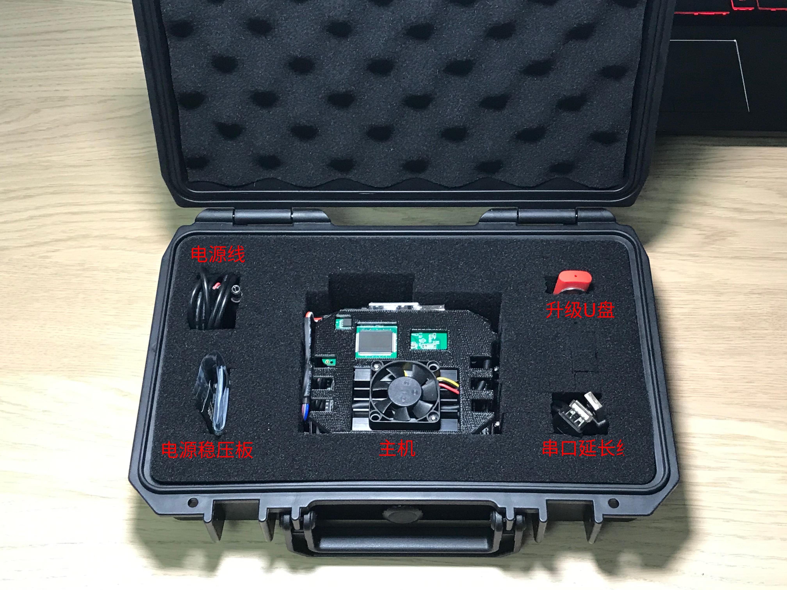
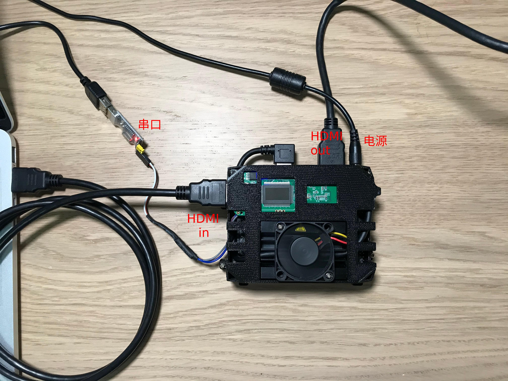
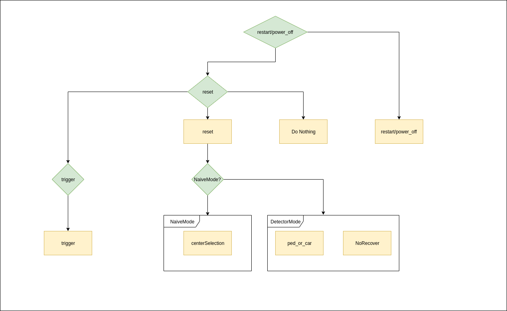
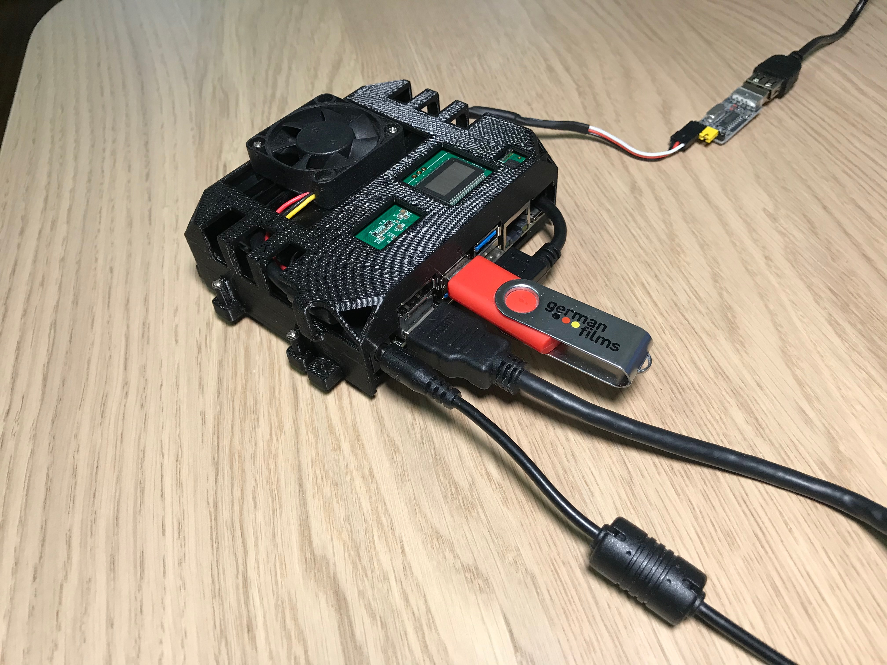

# 英徕智能机载AI : 目标跟踪系统使用说明

--------------

## 盒内部件介绍

* 介绍
  * 主机 : 机载AI 主机
  * 电源线 : 具有5V圆形接口的裸电源线
  * 电源稳压板 : DC-DC 直流降压模块, 附带使用说明 (已测试)
  * 升级U盘 : 未来更新程序存放位置, 用于插入AI主机之后进行自动升级
  * 串口延长线
* 图片
  * 

----------------

## 接口以及连接方式

* 接口列举
  * HDMI-in
  * HDMI-out
  * 串口
  * 电源
* 图片
  * 

-------------------------

## 运行上位机控制Demo

* 简介
  * 上位机发送端 : https://github.com/electrixoul/ELAI_UART_Control
  * 上位机接收端 : https://github.com/electrixoul/ELAI_UART_Read
* 编译步骤见README
* 运行步骤见视频

-------------------------
## 串口协议

* PC -> ELAI
  * 串口发送格式
    * 长度: 12字节
    * 开始符号: @
    * 终止符号: #
    * 中段数据: 10字节
  * 控制指令编码器类 : ModeSetting
  * 具体用法请参照 UART_control/uart.cpp
* ELAI -> PC
  * 串口发送格式
    * 长度: 11字节
    * 无开始符号
    * 终止符号: #
    * 中段数据: 10字节
  * 接收数据联合体: OutputPack
  * 具体用法请参照  UART_receive/uart.cpp

-------------------------
## 功能

* 功能树
  * 下图表示当前系统在接收到一条PC控制指令之后所进行的判断(浅绿色菱形), 以及所做出的动作(黄色矩形)
    
* 功能简介

  * 机载AI工作流程: AI盒子在启动之后会以非阻塞方式读取串口控制指令, 进而将读入的12字节控制数据包中的10字节数据域使用 "控制指令编码器类ModeSetting" 进行解码, 也就是调用ModeSetting::decode() 函数. 解码完成后,从PC传入的指令会存在于ModeSetting的以下成员变量中:

    ```c++
    	bool NaiveMode = true;		// 是否进入NaiveMode
        bool NaiveMode_ClickSelection = true;	// NaiveMode下的目标选择方式
        bool ped_or_car = 0;		// 目标检测跟踪模式下的目标类别
        bool NoRecover = true;		// 目标检测跟踪模式下, 丢失之后是否进行目标重找回
        bool centerSelection = true;// 是否采用画面中心准星进行目标锁定
        bool reset = false;			// 本次指令是否为 重置模式 指令
        bool trigger = false;		// 本次指令是否为 目标锁定 指令
        bool power_off = false;		// 关闭电源
    
        int left_up_x = 0;			// 手动锁定目标时, 目标的画面位置
        int left_up_y = 0;
        int roi_width = 0;
        int roi_height = 0;
    
    ```

  * 具体用法请参考 演示视频, 以及 UART_control 示例项目

--------------

## 程序自动升级

* 功能描述
  * 在需要升级AI盒子软件时, 我们会发送一个软件升级包给您, 您需要将软件升级包拷贝到U盘中, 然后插入AI盒子的USB端口
  * 系统在扫描到外部驱动器中的数据包, 并且一旦发现目标的版本号大于本机上运行的软件版本时, 会关闭软件, 进行自动升级, 整个过程会持续一分钟.
  * 当您看到AI盒子输出的画面重新出现目标跟踪界面时, 则代表升级已经完成, 可以拔出U盘
* 示范
  * 


